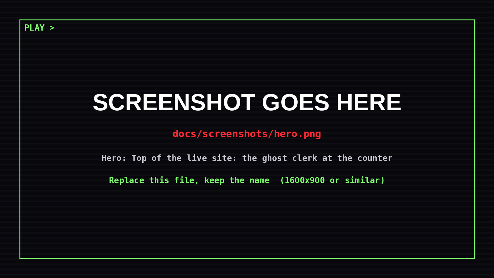
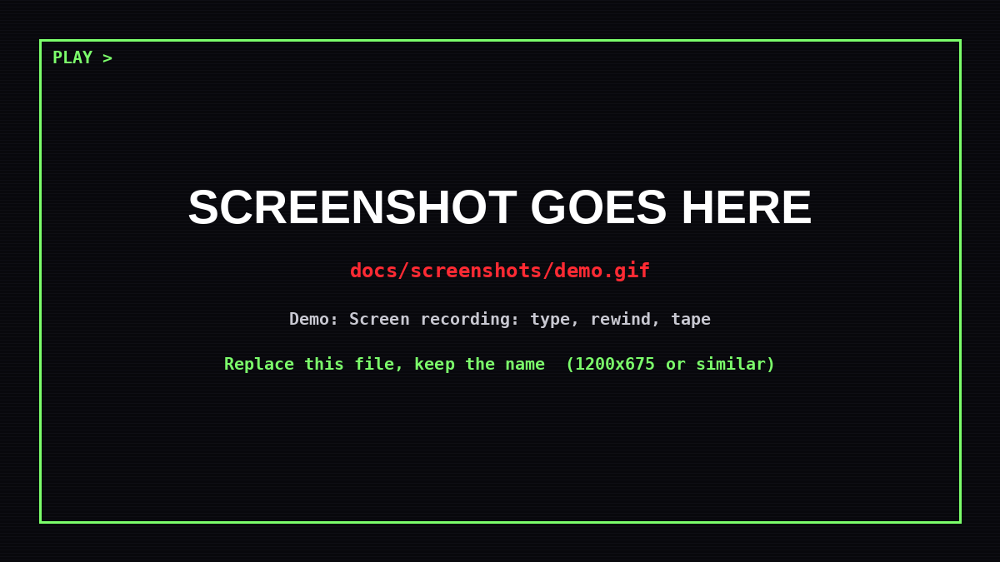
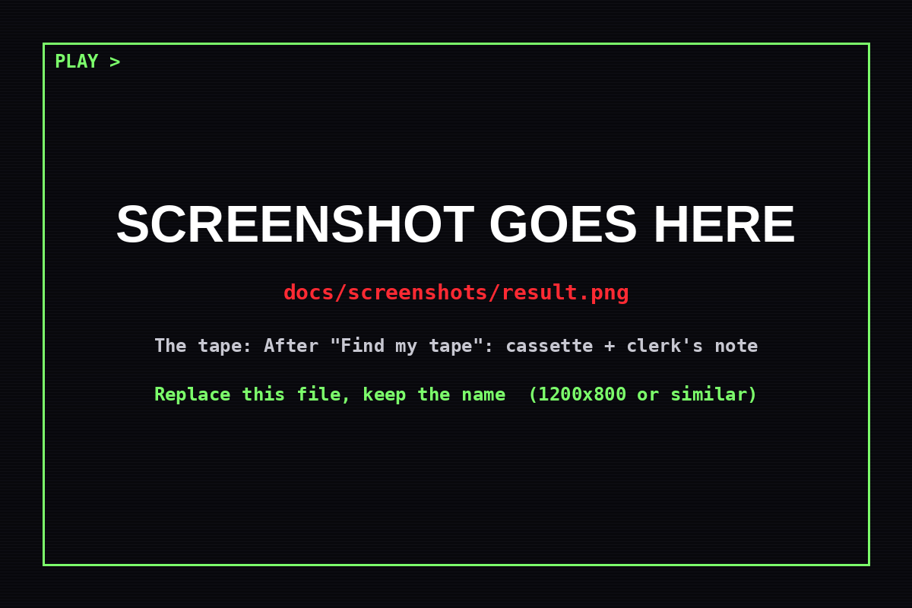
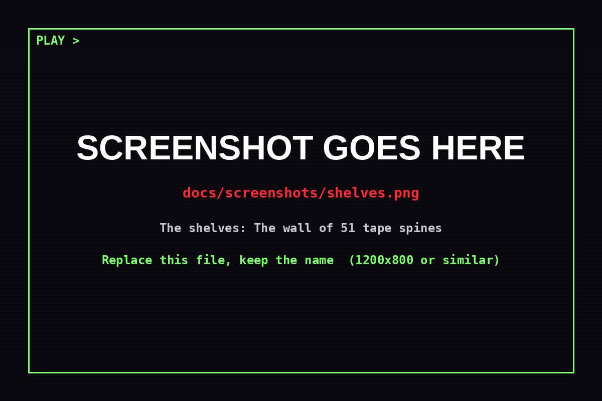
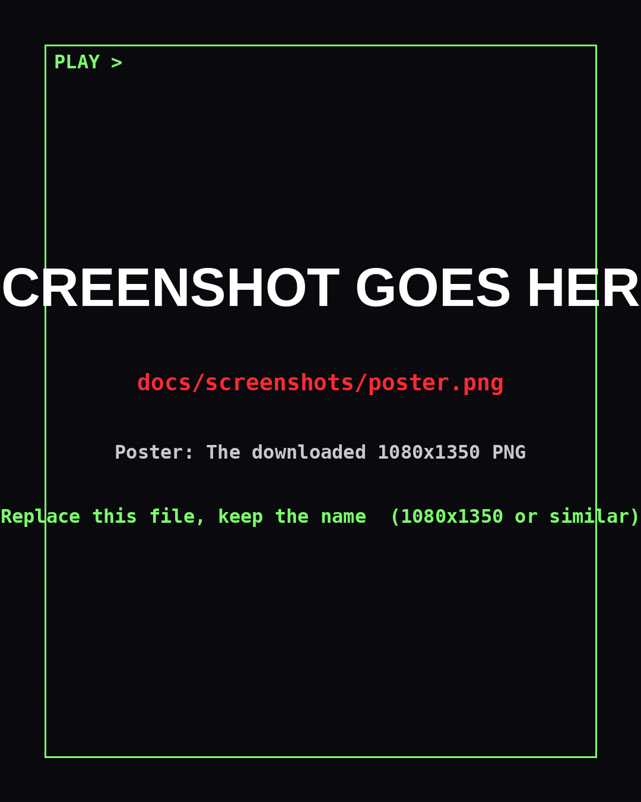
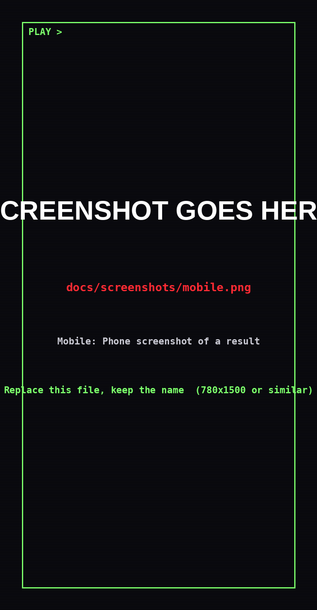

<h1 align="center">Mood → Horror Pick</h1>

<p align="center"><b>Tell the clerk how your week went. She'll pull the horror movie, game or series that fits, with a sarcastic note on why.</b></p>

<p align="center">
  
  
  
</p>

<p align="center">
  
</p>

<p align="center">
  
</p>

---

## What it is

A late-night video store that only stocks horror. You type how your day or week has been ("exam week, zero sleep, and my boss said let's circle back"). A deadpan ghost clerk pulls the tape that matches, as a real VHS cassette, with a typewriter note that quotes your own words back at you with dry sarcasm, what to snack on, and when to skip it. Don't like it? Ask for another tape. Love it? Make a poster for the group chat.

## The part worth explaining: the AI can't invent a movie

Recommenders built on LLMs tend to hallucinate titles, years and plots. This one is built so that cannot reach the page:

- The picks come from a **hand-curated shelf of 153 real titles** (90 films, 34 games, 29 series) in [`lib/catalog.js`](lib/catalog.js), each with a year, a dread level (1 to 5), a pace and mood tags.
- The server sends the model **only the titles that fit the request**: the right format, at about your scare level (that level and the one just below it, widened only if too few titles exist), and (because the shelf is big) capped at the 70 best matches for your mood plus a few wildcards, which keeps each request fast and cheap. It asks the model to answer with a shelf `id`.
- The server then **rejects any id that is not in that exact list** (even a real title that exists elsewhere on the shelf but was not shown for this request). A made-up title, a real title in the wrong format, or one scarier than allowed all get a 502, and the page quietly falls back to its built-in clerk.
- The title, year and premise shown on the page always come **from the catalog, never from the model**. The model only writes the note, the snack pairing and the "skip it if" line, and those are escaped before rendering.

## Where to watch or play (and being honest about it)

Streaming libraries change by country and by month, so a hard-coded "it's on Netflix" goes stale quickly. This project answers in three layers, and never guesses:

1. **Live lookup (movies and series).** When `TMDB_API_KEY` is set, [`api/where.js`](api/where.js) asks TMDB's watch-provider data (which comes from **JustWatch**) what is available **in the visitor's country right now**: subscription services, free or ad-supported, rent and buy. The page shows it with a `LIVE` chip and credits JustWatch and TMDB. Details:
   - It only accepts ids of titles already on the shelf, never free text, so it cannot be used as a general proxy.
   - It matches a title only when the name **and** year clearly agree (`lib/tmdb.js`). Anything unclear is reported as `unknown`, not guessed. You can pin an exact TMDB id with an optional `tmdb` field on a catalog entry.
   - Good answers are cached for 12 hours and are CDN-cacheable. Errors are never cached.
   - The visitor's country comes from the browser language (`en-IN` gives `IN`, `en-GB` gives `GB`) and defaults to India. Only the shelf id and the country code are sent, never anything the visitor typed.
2. **A known home from the catalog.** A title can carry a `where` field, but only if it has a stable home: a Netflix or Prime Video original, an India-specific release, or the platforms a game has shipped on. Right now that is 53 of 153 titles. Games always use this layer (TMDB covers movies and TV only).
3. **The clerk admits it, in character.** If neither layer knows, she says so in a spooky way ("This tape has slipped off every shelf I know...") and links to live lookups: **JustWatch** for movies and series (region from the browser), **Steam** for games, plus a web search. Links open in a new tab with `rel="noopener noreferrer"`. Some embedded or preview windows forbid new tabs (a sandboxed frame without `allow-popups`), so a blocked click shows the link in a small box, already selected, with a COPY button, and every row also has a one-click **COPY LINK** button. Ctrl/Cmd-click and keyboard Enter keep working normally.

If the live lookup is unavailable (no key, no backend, timeout, TMDB down), the page silently keeps layer 2 or 3. The AI never writes this part, so it cannot hallucinate a platform.

**Attribution is required.** TMDB asks for attribution, and its watch-provider data must credit JustWatch. The page shows "Where-to-watch data: JustWatch, via the TMDB API. This product uses the TMDB API but is not endorsed or certified by TMDB." as soon as live data appears. TMDB's guidelines also ask for their logo; this repo does not include it, so add it from TMDB's site before you share the live site widely.

## What it does

<table>
  <tr>
    <td width="50%" valign="top">
      
      <br><b>The tape</b><br>
      A cassette with the real title, year and dread level, a typewriter-style clerk's note, a snack to pair with, a "skip it if" warning, and a backup tape.
    </td>
    <td width="50%" valign="top">
      
      <br><b>The shelves</b><br>
      All 153 titles as tape spines, filterable by film, game or series, with a search box (by title or year). Tap one to peek at its premise and mood tags.
    </td>
  </tr>
  <tr>
    <td width="50%" valign="top">
      
      <br><b>The poster</b><br>
      A 1080x1350 PNG in VHS-cover style, ready for a WhatsApp status or an Instagram story.
    </td>
    <td width="50%" valign="top">
      
      <br><b>Built for phones too</b><br>
      Single column, no horizontal scroll, light and dark themes, reduced-motion friendly.
    </td>
  </tr>
</table>

Also: **scare level** (a 1 to 5 target, not just a limit: the clerk aims for that level and the one just below it, so "Bring it on" really is scary and "Gentle" really is cosy), **format** (tick any combination of movies, series and games, so "movies + series" works), a ghost clerk who reacts as you type ("Ghosted? Rude. Ghosting is MY department."), **SURPRISE ME**, and eight spooky stickers in the margins on wide screens (pumpkin, ghost, VHS tape, candle, skull, bat, popcorn, eyeball). Hover one and it spins, some clockwise and some counter-clockwise, then eases to a stop.

## How it works

```text
browser                                    Vercel                          Anthropic
-------                                    ------                          ---------
type a mood, pick format + scare level
 -> if it sounds like real distress:
    show a gentle care card (no joke, no pick, no network call)
 -> POST /api/pick  ------------------->   api/pick.js
                                            - filter the shelf (format, scare level, avoid list),
                                              keep the 70 best mood matches + a few wildcards
                                            - send only those titles + the mood  ---->  Claude (Haiku-class)
                                            - validate: id must be in the filtered list  <----
 <- {id, backup_id, note, pairs, skip} <--
render the tape from the CATALOG entry (title/year/premise), type out the note

if the call fails (no key, 429, timeout, bad JSON, unknown id)
 -> the built-in clerk picks from the same shelf in the browser
```

### The built-in clerk

When the AI is unavailable, the browser reads your words and picks from the same shelf, so it is deliberately simple and says so on the result. It understands 16 moods (grief, breakup, burnout, pressure, anxiety, loneliness, rage, boredom, fun, nostalgia, adrenaline, curious, family, cosy, guilt, paranoia, plus "friends"), scores every title on tag overlap inside the scare-level window, and writes the note from templates that quote your own words. If it cannot read what you typed, it says "I couldn't tell which mood that was" instead of pretending the slip was empty. It is not an LLM; the real AI understands free text far better, which is why it is the first choice.

### How the scare level works

The slider is a **target**, not just a ceiling. A ceiling alone ("nothing scarier than 5") is satisfied by every title, so a mild mood would still get a cosy pick at "Bring it on". Instead, [`scareWindow`](lib/moods.js) keeps the titles at the chosen level **and the one just below it**, and widens downwards only if fewer than 8 titles qualify (a tiny pool falls back to the 6 closest to the level). The server and the page use the exact same function (`npm run sync` copies its source into `index.html`, and a test checks they are identical). The "show me something gentle" button on the care card always forces the gentlest level, whatever the slider says.

**You can also just say it.** The words "scare me", "I want to be terrified" or "nothing too scary" are read as an *intent* about how scary you want it (`detectIntent` in [`lib/moods.js`](lib/moods.js)). If you have not touched the slider, the clerk nudges the level for you (strong wording such as "terrify me" goes straight to the top; "cosy" or "I scare easily" goes gentle) and the result says so. Once you move the slider yourself, it always wins. "I scare easily" is never read as "scare me", and an ordinary bad week ("this week was brutal", "I'm scared about my results") is not read as a request at all. Keyword matching cannot tell *asking* from *recounting* ("I saw a scary movie and hated it" is read as a request), which is why the nudge is always announced and easy to override.

One limit to know about: the shelf only has two series at dread 4 or more, so "series + Bring it on" includes some dread-3 series. Growing the shelf with scarier series fixes that.

## Safety

Typing "how's your week" can surface real distress, so:

- If the text looks like serious distress or self-harm, the page **does not joke and does not recommend a horror tape**. It shows a short, warm care card with **Tele-MANAS (14416)** for India, a prompt to contact a local helpline or someone you trust elsewhere, and an optional "show me something gentle" button. The check runs in the browser and again on the server, so no LLM call is made.
- The AI is told to roast the mood, never the person (no jokes about looks, body, religion, caste, gender, background or health), and to return a care response instead of a pick if it senses distress.
- Everyday hyperbole ("this exam is killing me") is deliberately **not** flagged. There are tests for both directions.

## Privacy

The live where-to-watch lookup sends only a shelf id and a country code. Your words are sent to an AI service only to write the clerk's note. This site does not store them, and the provider handles them under its own data policy. If you would rather not send anything, the built-in clerk works entirely in your browser.

## Deploy on Vercel

1. Push this repo to GitHub.
2. In Vercel: **Add New > Project**, import the repo, leave build settings empty.
3. Under **Environment Variables**, add `ANTHROPIC_API_KEY` with your own key. Optionally add `PICK_MODEL` (default is a small Haiku-class model).
4. Optional, for live where-to-watch: add `TMDB_API_KEY` (a free v3 API key from your TMDB account settings, under API). Without it the page keeps its built-in answers.
5. Deploy. If you add or change a variable later, **redeploy**.
6. Open the site and find a tape. The result should say **picked by the AI clerk**. If it says **built-in clerk**, the Anthropic key is missing or the call failed. For a movie or series, the where-to-watch row should show a `LIVE` chip within a second or so.

**Protect your wallet.** A public page that calls an LLM can run up a bill if it goes viral.
- Set a hard monthly spend limit in the Anthropic Console's billing and limits settings.
- Each request sends at most 70 shelf lines (a few thousand tokens) to a small model, so it stays cheap, but it is still a cost on a public page.
- The function caps input at 600 characters and allows about 10 requests per visitor per 10 minutes. That limit is held in memory per serverless instance, so it is best-effort. The spend limit is the real protection.
- Never put the key in `index.html` or commit `.env` files. `.gitignore` already excludes them.

## Run it locally

```bash
git clone <this repo's URL>
cd mood-horror-pick
npm test                     # catalog integrity + server tests, with a mocked API (no key needed)

# built-in clerk only (no key needed): just open the file
open index.html

# full stack with the AI call
cp .env.example .env.local   # then put your key in it
npx vercel dev
```

## Add or change titles

1. Edit [`lib/catalog.js`](lib/catalog.js). Each entry needs an id, title, year, type (`film`, `game` or `series`), dread (1 to 5), pace, at least two mood tags from the `TAGS` list, and a one-line premise. The words that map to moods ("ghosted", "exam", "boss"...) live in [`lib/moods.js`](lib/moods.js).
2. Optionally add `where` (for example `'Netflix'`, or `'PC (Steam), PlayStation, Xbox'` for a game) **only if you are sure**. Leave it out when unsure and the clerk will say she doesn't know. Films and series may only name Netflix, Prime Video or SonyLIV (India); the tests enforce that.
3. Run `npm run sync`. This copies the catalog and the mood patterns into `index.html` so the page and the server never drift.
4. Run `npm test`. It checks that ids are unique, tags and years are valid, every mood tag has coverage, and that the catalog embedded in `index.html` is identical to `lib/catalog.js`.

Please only add titles you are sure exist, with the right year and an accurate one-line premise. If you spot a mistake in an existing entry, fix it in `lib/catalog.js` and run `npm run sync`. The test suite also catches duplicate ids and titles, malformed entries, and a catalog that is out of sync with the page.

## Grow the shelf from a dataset (you stay in charge)

A dataset can find candidates, but it cannot judge them: it has no dread level, no mood tags and no premise, and raw data is noisy. So the pipeline automates the discovery and keeps a human on every decision. Full steps are in [`data/README.md`](data/README.md).

```bash
TMDB_API_KEY=... npm run import:tmdb          # or: npm run import:imdb -- --basics ... --ratings ...
# open data/candidates.json, fill in dread / pace / tags / blurb for the ones you want, set "approved": true
npm run merge:dry                             # shows exactly what would be added
npm run merge                                 # adds it, syncs the page; if ANY entry is invalid, nothing is written
npm test
```

- The importer **never edits the shelf**. It proposes `candidates.json` (git-ignored, because it holds third-party data).
- The merge step is the only code that edits `lib/catalog.js`. It validates **every** approved entry first, lists **all** problems at once, writes nothing if any is wrong, re-reads what it wrote, and rolls back if it does not match.
- It rejects a premise that simply copies the TMDB description. Write it in your own words.
- Duplicates (same id, same title and year, same TMDB id) are rejected.
- Aim for a few hundred well-judged titles, not thousands: the shelf's value is that every entry is correct, and when unsure about `dread`, round up.
- Data terms: TMDB is free for non-commercial use with attribution; the IMDb files are personal and non-commercial only. Re-read both before this ever stops being a free portfolio project.

## Project structure

```text
mood-horror-pick/
├── index.html               the whole front end (HTML, CSS, JS, SVG art, embedded catalog)
├── api/pick.js              Vercel serverless function that calls the LLM and validates the answer
├── api/where.js             live where-to-watch for shelf titles (TMDB watch providers via JustWatch)
├── lib/catalog.js           the curated shelf (single source of truth)
├── lib/moods.js             mood words shared by the server and the page
├── lib/tmdb.js              TMDB helpers: strict title+year matching, URLs, safe provider names
├── lib/validate.js          the one definition of a valid shelf entry (merge step and tests)
├── scripts/sync-catalog.js  copies the catalog into index.html
├── scripts/import-candidates.js  proposes new titles from TMDB or IMDb files (never edits the shelf)
├── scripts/merge-candidates.js   the only code that edits the shelf: validate all, then write, verify, or roll back
├── data/                    import workflow notes + an example (candidates.json is git-ignored)
├── tests/                   catalog, server, live-lookup, import and merge tests (all mocked, no keys needed)
├── docs/screenshots/        images used by this README
├── .env.example
├── package.json
├── LICENSE
└── README.md
```

## Built with

Vanilla HTML, CSS and JavaScript, inline-SVG art, the Canvas API for the poster, and a single Vercel serverless function. Vibe-coded with Claude, then tested in a headless browser. Fonts (Anton, IBM Plex Sans, Special Elite, VT323) load from Google Fonts under the SIL Open Font License.

## License

MIT (see [`LICENSE`](LICENSE)). The ghost, the cassette and the margin stickers are original artwork drawn in SVG for this project. Movie, game and series titles belong to their respective owners and are listed here only as recommendations.

---

<p align="center">Built by <b>Tharini</b></p>
